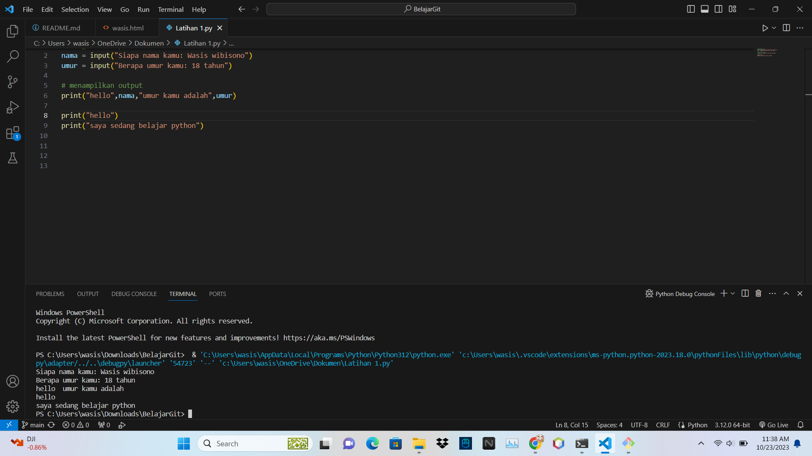
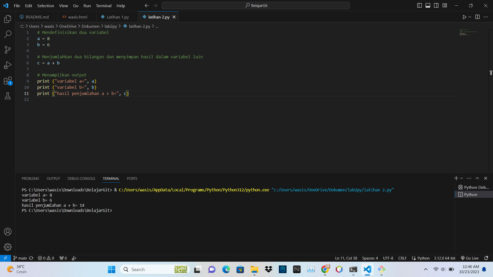
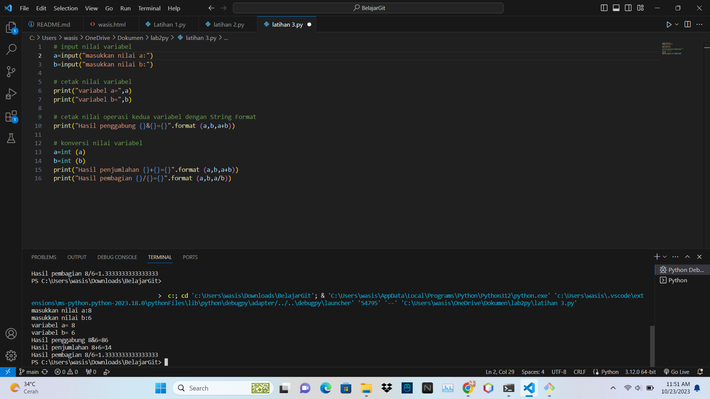

+ <h1>Tugas B.Pemograman<h1>
+ 
buat repository di git hub

+ 
echo "latihan 2" >> README.md

+ 
github comit -m "deskripsi file"

+ 
 upload ss an di github 

+ 
lalu salin link lalu kirimkan ke tugas latihan 2 B.pemograman

+ <h1>Latihan 1</h1>

+ <h1>Latihan 2</h1>

+ <h1>Latihan 3</h1>

